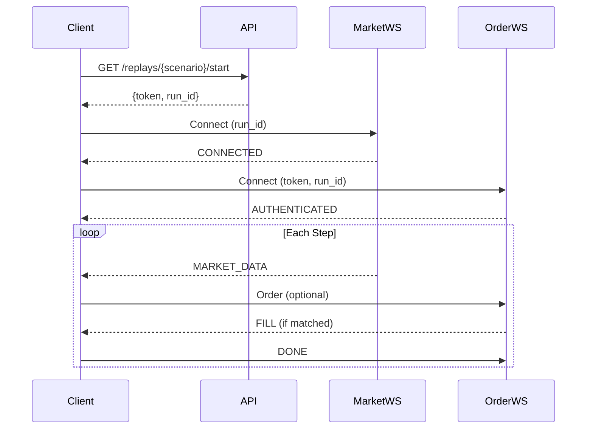

# Exchange Simulator API Reference

This document describes the REST API endpoints, WebSocket connections, and message formats for the Exchange Simulator.

---

## Table of Contents

- [Authentication](#authentication)
- [REST API Endpoints](#rest-api-endpoints)
- [WebSocket Connections](#websocket-connections)
- [Message Formats](#message-formats)
- [Error Handling](#error-handling)

---

## Authentication

All API requests require authentication using a **Bearer token** in the `Authorization` header.

```
Authorization: Bearer <your_team_name>
```

For protected endpoints, you must also include your team password:

```
X-Team-Password: <your_password>
```

---

## REST API Endpoints

Base URL: `http://<host>:<port>/api/replays`

### List All Scenarios

**Endpoint:** `GET /replays`

**Description:** List all available trading scenarios.

**Response:**
```json
[
  {
    "scenario_id": "normal_market",
    "name": "Normal Market",
    "description": "Stable market conditions",
    "seed": 12345,
    "duration_sec": 300.0,
    "your_runs": 5,
    "your_best_pnl": 1250.50
  }
]
```

---

### Start a Scenario

**Endpoint:** `GET /replays/{scenarioId}/start`

**Description:** Register for a scenario and receive a token to start trading.

**Headers:**
| Header | Required | Description |
|--------|----------|-------------|
| `Authorization` | Yes | `Bearer <team_name>` |
| `X-Team-Password` | Yes | Your team password |

**Response:**
```json
{
  "run_id": "abc123-def456",
  "token": "eyJhbGciOiJIUzI1NiIsInR5cCI6IkpXVCJ9...",
  "seed": 12345,
  "duration_sec": 300.0,
}
```

**Error Responses:**

| Status | Reason |
|--------|--------|
| 401 | Unknown team or invalid password |
| 403 | Registration disabled |
| 429 | Too many runs (max 10 per hour) |
| 400 | Scenario not found or already running |

---

### List Your Runs

**Endpoint:** `GET /replays/{scenarioId}/my-runs`

**Description:** Get all your runs for a specific scenario.

**Response:**
```json
{
  "scenario_id": "normal_market",
  "total_runs": 3,
  "runs": [
    {
      "run_id": "abc123",
      "started_at": "2026-01-17T10:00:00Z",
      "completed_at": "2026-01-17T10:05:00Z",
      "final_pnl": 1250.50,
      "rank": 3
    }
  ]
}
```

---

### Get Leaderboard

**Endpoint:** `GET /replays/{scenarioId}/leaderboard`

**Description:** Get the leaderboard for a scenario.

**Response:**
```json
{
  "scenario_id": "normal_market",
  "scenario_name": "Normal Market",
  "total_participants": 25,
  "entries": [
    {
      "rank": 1,
      "student_id": "team_alpha",
      "best_pnl": 5000.00,
      "final_inventory": 0,
      "runs": 10,
      "notional": 1500000.0,
      "trade_count": 150,
      "max_inventory": 500,
      "aggressive_trade_qty": 10000,
      "blowup": false,
      "blowup_reason": null,
      "total_decision_time_ms": 2500
    }
  ]
}
```

---

### Get Student History

**Endpoint:** `GET /replays/{scenarioId}/student/{studentId}`

**Description:** Get all runs for a specific student in a scenario.

**Response:**
```json
[
  {
    "run_id": "abc123",
    "started_at": "2026-01-17T10:00:00Z",
    "completed_at": "2026-01-17T10:05:00Z",
    "final_pnl": 1250.50,
    "final_inventory": 100,
    "blowup": false,
    "blowup_reason": null,
    "trade_count": 50,
    "notional": 500000.0
  }
]
```

---

## WebSocket Connections

### Market Data WebSocket

**URL:** `ws://<host>:<port>/api/ws/market?run_id=<run_id>`

For secure connections: `wss://<host>:<port>/api/ws/market?run_id=<run_id>`

**Description:** Receive real-time market data snapshots.

---

### Order Entry WebSocket

**URL:** `ws://<host>:<port>/api/ws/orders?token=<token>&run_id=<run_id>`

For secure connections: `wss://<host>:<port>/api/ws/orders?token=<token>&run_id=<run_id>`

**Description:** Submit orders and receive fill notifications.

---

## Message Formats

### Market Data Messages

#### Connection Confirmation
```json
{
  "type": "CONNECTED",
  "message": "Connected to market data stream"
}
```

#### Market Snapshot
```json
{
  "type": "MARKET_DATA",
  "step": 100,
  "timestamp": "2026-01-17T10:00:00.000Z",
  "bid": 99.50,
  "ask": 100.50,
  "bid_size": 1000,
  "ask_size": 1500,
  "spread": 1.00,
  "bids": [
    {"price": 99.50, "qty": 500},
    {"price": 99.25, "qty": 500}
  ],
  "asks": [
    {"price": 100.50, "qty": 750},
    {"price": 100.75, "qty": 750}
  ],
  "trades": [
    {"price": 100.00, "qty": 100, "side": "BUY"}
  ],
  "last_trade": {"price": 100.00, "qty": 100, "side": "BUY"}
}
```

> [!NOTE]
> The **mid price** is not provided by the server. Calculate it yourself: `mid = (bid + ask) / 2`

---

### Order Entry Messages

#### Authentication Confirmation
```json
{
  "type": "AUTHENTICATED",
  "student_id": "team_alpha",
  "run_id": "abc123",
  "message": "Connected and recording"
}
```

---

### Messages You Send (Client → Server)

#### New Order
```json
{
  "order_id": "ORD_team_alpha_100_0",
  "side": "BUY",
  "price": 100.25,
  "qty": 100
}
```

| Field | Type | Description |
|-------|------|-------------|
| `order_id` | string | Unique order identifier |
| `side` | string | `"BUY"` or `"SELL"` |
| `price` | number | Order price (limit) |
| `qty` | integer | Quantity (must be multiple of 100) |

#### Cancel Order
```json
{
  "action": "CANCEL",
  "order_id": "ORD_team_alpha_100_0"
}
```

#### Signal Done (Advance Step)
```json
{
  "action": "DONE"
}
```

> [!IMPORTANT]
> You **must** send a `DONE` message after processing each market snapshot to advance to the next simulation step.

---

### Messages You Receive (Server → Client)

#### Fill Notification
```json
{
  "type": "FILL",
  "order_id": "ORD_team_alpha_100_0",
  "side": "BUY",
  "price": 100.25,
  "qty": 100,
  "remaining": 0,
  "is_maker": false
}
```

| Field | Type | Description |
|-------|------|-------------|
| `type` | string | Always `"FILL"` |
| `order_id` | string | Your order ID |
| `side` | string | `"BUY"` or `"SELL"` |
| `price` | number | Execution price |
| `qty` | integer | Filled quantity |
| `remaining` | integer | Remaining unfilled quantity |
| `is_maker` | boolean | `true` if you were the maker (passive), `false` if taker (aggressive) |

#### Error Message
```json
{
  "type": "ERROR",
  "message": "Quantity must be a multiple of 100"
}
```

---

## Error Handling

### Common Error Messages

| Error | Cause | Resolution |
|-------|-------|------------|
| `Quantity must be a multiple of 100` | Order qty not divisible by 100 | Use qty like 100, 200, 300... |
| `Rate Limit Exceeded: Max 50 open orders` | Too many unfilled orders | Wait for fills or cancel orders |
| `Step advance failed` | Error advancing simulation | Check connection and retry |

### Rate Limits

- **Runs:** Maximum 10 runs per hour per team
- **Open Orders:** Maximum 50 open orders at any time
- **Quantity:** All quantities must be multiples of 100

> [!CAUTION]
> Exceeding the open order limit will **terminate your run** immediately.

---

## Quick Start Example

```python
# 1. Register and get token
response = requests.get(
    f"{host}/api/replays/{scenario}/start",
    headers={
        "Authorization": f"Bearer {team_name}",
        "X-Team-Password": password
    }
)
token = response.json()["token"]
run_id = response.json()["run_id"]

# 2. Connect to WebSockets
market_ws = websocket.connect(f"{host}/api/ws/market?run_id={run_id}")
order_ws = websocket.connect(f"{host}/api/ws/orders?token={token}&run_id={run_id}")

# 3. Trading loop
while running:
    # Receive market data
    data = json.loads(market_ws.recv())
    
    # Make trading decision
    if should_buy:
        order_ws.send(json.dumps({
            "order_id": "ORD_001",
            "side": "BUY",
            "price": data["ask"],
            "qty": 100
        }))
    
    # Signal done to advance
    order_ws.send(json.dumps({"action": "DONE"}))
```

---

## Protocol Summary


